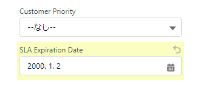

# salesforce-lightning-autoinput
Javascriptによる salesforce lightning の自動データ登録ライブラリです。

## Features
対応している入力種類は以下の通り
* lightning-input
	* text
	* checkbox
* lightning-textarea
* lightning-datepicker
* lightning-timepicker
* lightning-datetimepicker
* lightning-input-address
* lightning-combobox
* lightning-grouped-combobox
* lightning-button
## Usage
※sectionは省略可

* lightning-input
	* text
	```
	slai.run(label_name, "value", section)
	```
	* checkbox
	```
	slai.run(label_name, 'check', section)
	slai.run(label_name, '', section)
	```
	※value : 'check'でチェックボックスにチェックが入ります。<br>
	それ以外の値を設定した場合は、チェックを外します。
* lightning-textarea
	```
	slai.run(label_name, "value\r\nvalue", section)
	```
* lightning-datepicker
	```
	slai.run(label_name, "yyyy/mm/dd", section)
	```
	※書式は、salesforceの設定にしたがって指定してください。
* lightning-timepicker
	```
	slai.run(label_name, "hh:mm", section)
	```
	※書式は、salesforceの設定にしたがって指定してください。
* lightning-datetimepicker
	```
	slai.run(label_name, "yyyy/mm/dd hh:mm", section)
	slai.run(label_name, date:"yyyy/mm/dd", time: "hh:mm"}, section)
	※書式は、salesforceの設定にしたがって指定してください。
	```
* lightning-input-address
	```
	slai.run("address", {province: "province", city: "city", street: "street", postalCode: "postal-code", country: "country"})
	```
	※書式は、salesforceの設定にしたがって指定してください。
* lightning-combobox
	```
	slai.run(label_name, "value", section)
	```
* lightning-grouped-combobox
	```
	slai.run(label_name, "value", section)
	```
* lightning-button
	```
	slai.run({ type: "button", wait: true }, "value", section)
	```
	※type : "button" 固定<br>
	wait: 保存時、待機する場合は trueを指定

## Example
```
await import('https://********.visualforce.com/salesforce-lightning-autoinput.js').then(async res => {
	const slai = new res.SalesforceLightningAutoinput();
	await slai.run("address", {province: "province", city: "city", street: "street", postalCode: "postal-code", country: "country"})
	await slai.run("SLA Expiration Date", "2021/01/01 01:23")
	await slai.run("SLA Expiration Date", {date:"2022/02/04", time: "01:23"})
	await slai.run({ type: "button", wait: true }, "Save");
});

```



## Notes
* そのままライブラリをimportしようとすると「content-security-policy」エラーが出るので<br>
WevView2を使用したプログラムで用いる場合は、ソースをローカルに保存して仮想ホストで 「visualforce.com」のドメイン扱いにするなどの対応をしてください。
```
 WebView2.CoreWebView2.SetVirtualHostNameToFolderMapping("SalesforceLightningAutoinput.visualforce.com", "contents", Microsoft.Web.WebView2.Core.CoreWebView2HostResourceAccessKind.Allow);
```